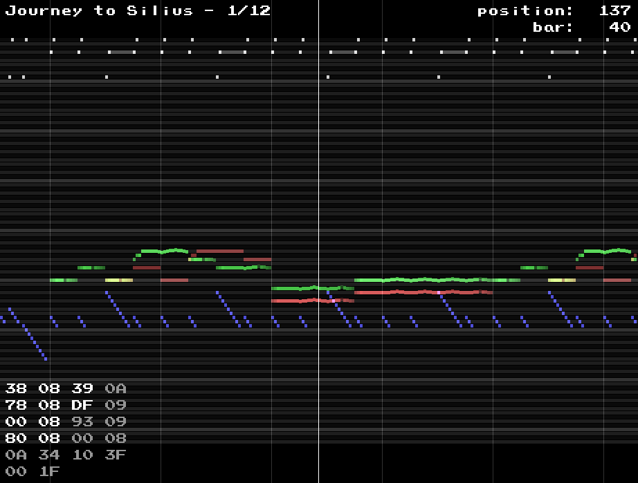

NSF monitor
===========

A NSF player with piano-roll-like visualization.
The APU emulation is not awesome but it works fine for all of my favourite music titles.
NSF files can be downloaded [here](https://www.zophar.net/music/nintendo-nes-nsf).

If you like it, you may also like [SID monitor](https://github.com/2bt/SID-monitor).

Each channel is shown in a certain color:
<table>
	<tr><td>pulse 1</td><td>red</td></tr>
	<tr><td>pulse 2</td><td>green</td></tr>
	<tr><td>triangle</td><td>blue</td></tr>
	<tr><td>noise</td><td>white</td></tr>
	<tr><td>DMC</td><td>-</td></tr>
</table>

## Controls

<table>
	<tr>
        <td><code>SPACE</code></td>
        <td>Toggle playback.</td>
    </tr>
	<tr>
        <td><code>1</code>/<code>2</code>/<code>3</code>/<code>4</code>/<code>5</code></td>
        <td>Toggle APU channels.</td>
    </tr>
	<tr>
        <td><code>LEFT</code>/<code>RIGHT</code></td>
        <td>
            Move through the song. 
            Hold <code>SHIFT</code> to move faster. 
            Hold <code>CTRL</code> to move frame by frame.
        </td>
    </tr>
	<tr>
        <td><code>BACKSPACE</code></td>
        <td>Jump to the beginning of the song.</td>
    </tr>
	<tr>
        <td><code>+</code>/<code>-</code></td>
        <td>Time zoom.</td>
    </tr>
	<tr>
        <td><code>PAGE DOWN</code>/<code>PAGE UP</code></td>
        <td>Pitch zoom.</td>
    </tr>
	<tr>
        <td><code>B</code></td>
        <td>Toggle bars.</td>
    </tr>
	<tr>
        <td><code>W</code>/<code>S</code>/<code>A</code>/<code>D</code></td>
        <td>Change bar offset/width.</td>
    </tr>
</table>

## TODO

+ PAL
+ length counter
+ ...
